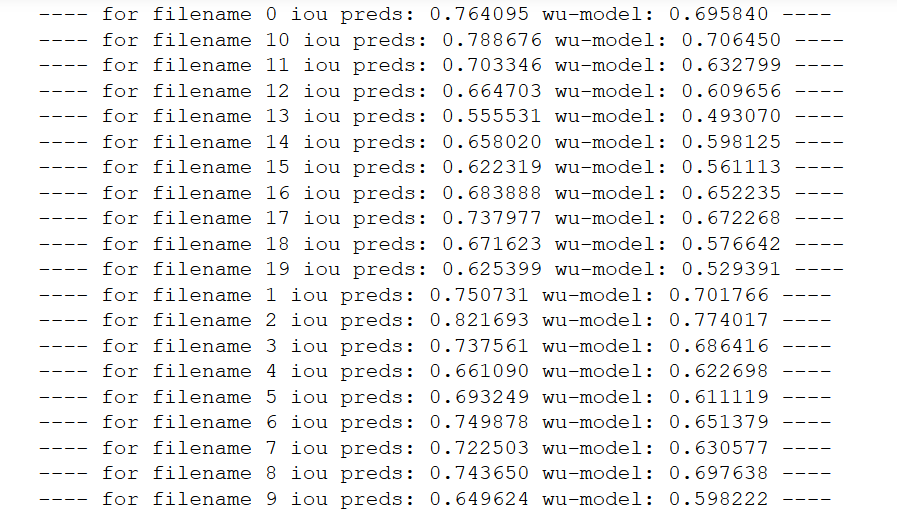

#### Fault picking with 3D-Unets

#### Meta-overview
PyTorch implementation of various 3d-unets for fault picking. We use [Xinming Wu's](https://github.com/xinwucwp/faultSeg) repository to get the training data (200 images and labels of size 128x128x128). We set aside 20 images as a holdout test set for accuracy benchmarking. These are the 20 images in the validation set of Wu's original implementation, but we keep these now as unseen test-set. The current best model in this repo (unet_3d_res1) siginificantly outperforms the original Wu model and a standard Vnet model in terms of iou on the test set.  

#### Current best model
* unet_3d_res1 is a standard 3D-UNet with Residual blocks. The primary performace uplift comes from using a simple Res-block which is structured as:  

&nbsp;&nbsp; Conv1-------------(+) IN -- LR  
&nbsp;&nbsp;&nbap;&nbsp; |&nbsp;&nbsp;&nbsp;&nbsp;&nbsp;&nbsp;&nbsp;&nbsp;&nbsp;&nbsp;&nbsp;&nbsp;&nbsp;&nbsp;|   
&nbsp;&nbsp;&nbap;&nbsp; |&nbsp;&nbsp;&nbsp;&nbsp;&nbsp;&nbsp;&nbsp;&nbsp;&nbsp;&nbsp;&nbsp;&nbsp;&nbsp;&nbsp;|   
&nbsp;&nbsp; IN -- LR --Conv2 -- |   
